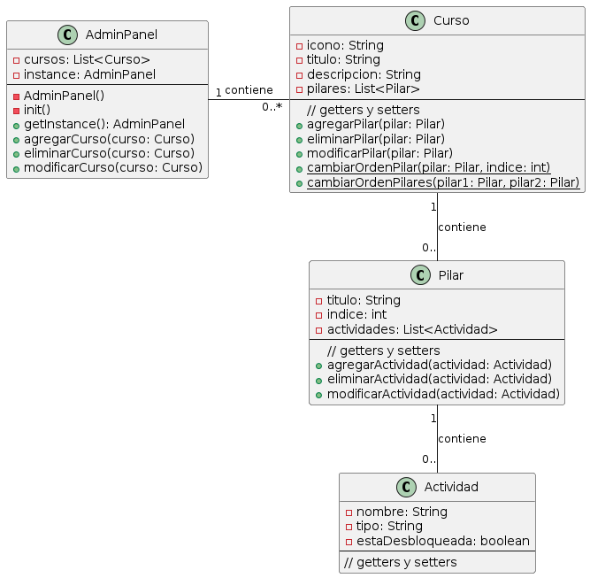
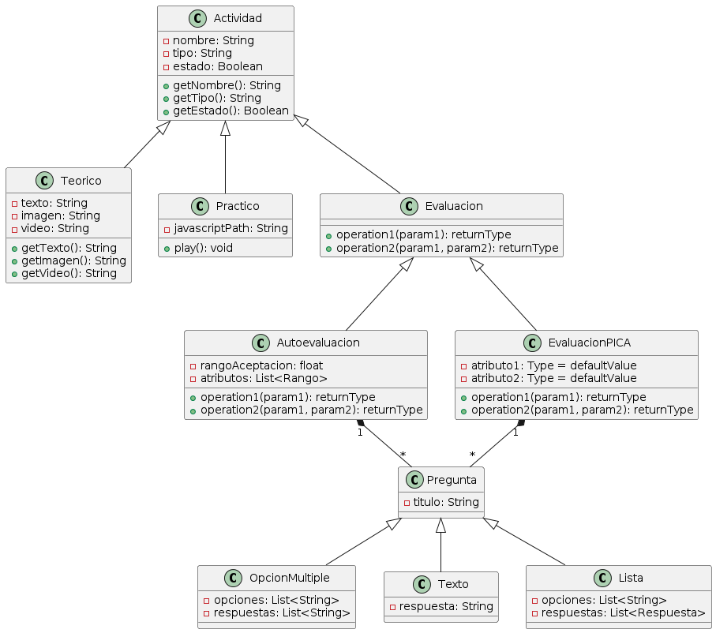
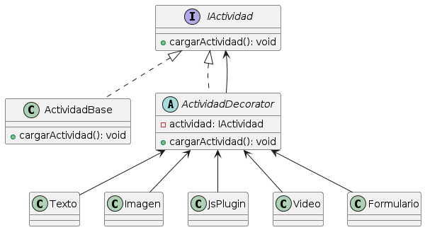

# AdAstra-diseno

## Integrantes
* Russel Adrian Bonilla Pech
* Jesús Mateo Ortíz Chay
* Rodrigo Joaquín Pacab Canul
* Orlando Isaías Rodríguez Couoh 

## Tareas del equipo:
[Aquí](https://github.com/iKinoo/AdAstra-diseno/tree/main/Tareas)

## Investigación previa de atributos de calidad:

* [RNF.1 Requerimientos de usabilidad](Tareas/InvestigacionRNF/Usabilidad) (Russel)
* [RNF 2. Requerimiento de confiabilidad](Tareas/InvestigacionRNF/Confiabilidad) (Isaías y Rodrigo)
* [RNF 3. Requerimiento de Seguridad](Tareas/InvestigacionRNF/Seguridad) (Isaías)
* [RNF. 4 Requerimiento de Flexibilidad](Tareas/InvestigacionRNF/Flexibilidad) (Mateo y Russel)

### Requerimientos No Funcionales elegidos y su justificación:

Después de hacer la investigación y gracias a los aprendizajes obtenidos durante el curso, hemos decidido que los **Requerimientos No Funcionales** con los que trabajaremos serán **Flexibilidad** y **Mantenibilidad** debido a que son más relevantes para AdAstra actualmente y es más viable hacer la comprobación en la etapa de diseño

### Requerimiento de Mantenibilidad (Reusabilidad)
[Documento de Reusabilidad](RNFs/Reusabilidad/Reusabilidad.md) 

<i>expandir o colapsar</i>

    
# Definición de Mantenibilidad según ISO/IEC 25010
La mantenibilidad se define como:

"La capacidad de un producto o sistema de software de ser modificado de forma efectiva y eficiente por los desarrolladores. Estas modificaciones pueden incluir corrección de errores, mejoras de rendimiento, adaptación a un entorno cambiante y agregación de nuevas funcionalidades."

> Para los propósitos de este proyecto, nos centraremos en la composición modular de los cursos y su estrecha relación con la reusabilidad, considerada un aspecto crítico de la mantenibilidad según la norma ISO/IEC 25010. 

## Reusabilidad 
### Definición de Reusabilidad según ISO/IEC 25010
La ISO/IEC 25010 es un estándar internacional que define un modelo de calidad para la evaluación de software. Dentro de la característica de mantenibilidad, la reusabilidad se define como:

"Capacidad de un producto o componente para ser utilizado en más de un sistema de software o en la construcción de otros productos o componentes."

### Contextualización en Ad-astra
En Ad-Astra, los cursos están compuestos por varios módulos a los que llamamos pilares. Algunos de estos módulos pueden ser parte de múltiples cursos. Si un estudiante completa un módulo en un curso y este mismo modulo aparece en otro curso, no es necesario que el estudiante lo vuelva a tomar. Esto indica que los pilares son reutilizables entre diferentes curso.

### Presencia de Reusabilidad
**Modularidad:**
Los pilares en Ad-astra están diseñados como módulos independientes que pueden ser combinados de diferentes maneras para formar distintas certificaciones. Esta modularidad es un aspecto clave de la reusabilidad.

**Bajo Acoplamiento y Alta Cohesión:**
Cada pilar tiene una responsabilidad específica (enseñar un tema particular) y puede ser usado de manera independiente en diferentes cursos sin que la estructura de los pilares dependa de las cursos en las que se incluyen. Este diseño de bajo acoplamiento (los pilares no dependen de la curso en la que están) y alta cohesión (cada pilar tiene un propósito bien definido) es un ejemplo clásico de componentes reutilizables.

**Eficiencia y Ahorro de Tiempo:**
Permitir a los estudiantes no repetir cursos ya completados en otras certificaciones aumenta la eficiencia del proceso de aprendizaje. Los estudiantes ahorran tiempo y esfuerzo, lo cual es un beneficio directo de la reusabilidad.

**Consistencia y Mantenimiento:**
Reutilizar cursos en diferentes certificaciones también asegura que la calidad y el contenido del curso son consistentes en todas las certificaciones. Además, mantener y actualizar un curso reutilizable es más sencillo porque los cambios se reflejan en todas las certificaciones que lo incluyen.

Estas prácticas de reusabilidad directamente contribuyen a mejorar la mantenibilidad del sistema de la siguiente manera:

**Modularidad:** Al diseñar los cursos y pilares como módulos independientes y reutilizables, se aumenta la modularidad del sistema. Esto facilita la localización y modificación de partes específicas del sistema sin afectar al resto.
**Analizabilidad:** La reusabilidad permite analizar y entender fácilmente cómo se relacionan y utilizan los componentes en diferentes contextos. Esto hace que sea más fácil evaluar el impacto de los cambios y diagnosticar problemas.
**Modificabilidad:** La capacidad de reutilizar componentes reduce la cantidad de código nuevo que debe escribirse y probarse, lo que facilita la implementación de cambios y nuevas funcionalidades.

**Capacidad de Prueba (Testabilidad):** Los componentes reutilizables tienden a estar mejor probados, lo que facilita la verificación de que las modificaciones no introducen nuevos errores y que el software sigue cumpliendo con sus requisitos.

### BONUS
**¿Podemos implementar algún patrón de diseño?**

Dos patrones particularmente útiles para este tipo de escenarios son el Patrón Composite y el Patrón Strategy.

### Composite
El concepto básico del patrón Composite consiste en representar objetos simples y sus containers (o contenedores, también llamados colecciones en algunos lenguajes, o sea: grupos de objetos) en una clase abstracta de manera que puedan ser tratados uniformemente. Este tipo de estructura se conoce como jerarquía parte-todo (en inglés: part-whole hierarchy), en la que un objeto es siempre, o una parte de un todo, o un todo compuesto por varias partes.

**¿Cómo nos beneficia usar este patrón?**

El patrón Composite ofrece una estructura jerárquica para representar cursos y sus componentes de manera flexible. Esto permite que los cursos estén formados por módulos que pueden contener submódulos, facilitando una organización clara y recursiva.

Además, promueve la reutilización de componentes al tratar tanto a los objetos individuales como a las composiciones de objetos de manera uniforme. Esto significa que los mismos módulos pueden ser utilizados en diferentes cursos, lo que simplifica el diseño y la implementación del sistema.

El mantenimiento y la modificación se simplifican con el patrón Composite, ya que las operaciones se aplican de la misma manera a objetos individuales y composiciones de objetos. Esto garantiza una consistencia en el código y facilita la actualización de componentes específicos sin afectar la estructura general.

Además, el patrón Composite es altamente escalable, lo que permite agregar nuevos componentes y cursos sin necesidad de cambiar la estructura del código existente. Esto es especialmente útil en entornos como Coursera, donde se manejan una gran cantidad de cursos y contenido educativo en constante evolución.

**Patrón Composite contextualizado en Ad-Astra:**

### Strategy
El patrón de diseño Strategy se encuentra entre los patrones de comportamiento que dotan al software con diferentes métodos de solución. Estas estrategias incluyen una variedad de algoritmos que son distintos del programa real y son autónomos (es decir, intercambiables). Un patrón de diseño de estrategia también incluye ciertas especificaciones y ayudas para los desarrolladores. Por ejemplo, los patrones de diseño de estrategia pueden describir cómo ensamblar clases, organizar un grupo de clases y crear objetos. Lo especial de los patrones de diseño de estrategia es que un programa variable y el comportamiento del objeto también pueden realizarse durante la ejecución del software.

**¿Cómo nos beneficia usar este patrón?**

El patrón Strategy ofrece flexibilidad en la composición de cursos al permitir encapsular diferentes algoritmos en estrategias separadas. Esto posibilita cambiar dinámicamente cómo se componen los cursos en tiempo de ejecución, sin necesidad de modificar la estructura de las clases de curso. Por ejemplo, se pueden tener estrategias basadas en el nivel de dificultad o en las preferencias del estudiante.

La reusabilidad de estrategias es otra ventaja, ya que cada algoritmo de composición de cursos se encapsula en una estrategia separada, lo que facilita su reutilización en diferentes partes del sistema. Esto promueve la modularidad y simplifica el mantenimiento del código.

El patrón Strategy también fomenta la separación de responsabilidades al desacoplar las políticas de uso de las clases de curso (contexto) de las implementaciones concretas de la composición de cursos (estrategias). Esto hace que el código sea más comprensible, mantenible y testeable, ya que cada estrategia se ocupa de una única responsabilidad.

Agregar nuevas estrategias de composición de cursos es sencillo con el patrón Strategy, ya que no afecta el código existente. Esto es útil en entornos como Coursera, donde se pueden experimentar con diferentes enfoques de composición de cursos o agregar nuevas funcionalidades sin problemas.

Finalmente, la facilidad para cambiar de estrategia durante la ejecución del programa permite adaptar el sistema a las necesidades o preferencias de los usuarios sin interrumpir su funcionamiento. Esto proporciona una mayor flexibilidad y capacidad de respuesta en la gestión de los cursos en la plataforma.

**Patrón Composite contextualizado en Ad-Astra:**

### Requerimiento de Flexibilidad

[Documento de Flexibilidad](RNFs/Flexibilidad/Flexibilidad.md)

## RNF elegidos y justificación:

# Flexibilidad

## Definición

Siguiendo la definición de la ISO/IEC-25010 definimos el atributo de flexibilidad como:

>Capacidad del producto para adaptarse a cambios en sus requisitos, contextos de uso o entorno del sistema.

## Contextualización

En AdAstra es fundamental la flexibilidad debido a que el sistema aún está en una etapa temprana y está sujeto al cambio en la forma de los cursos y actividades, estos pueden ser presentados como videos, texto, o incluso minijuegos, y dependiendo de los resultados pueden evolucionar los requerimientos y/o necesidades del sistema, es por eso que tenemos los siguientes RNF:

| Código |Descripción |
|--------|-------------|
| *RNF4.1* | Se podrán agregar nuevos cursos, pilares y actividades al sistema fácilmente. () |
| *RNF4.2* | Se podrá realizar un CRUD de cualquier curso, pilar o actividad sin afectar de alguna forma a los ya existentes y/o la estructura del sistema. |
|*RNF4.3*| *RNF3.3* Se podrán crear actividades de distintos tipos  facilmente sin afectar a las actividades existentes o al sistema

## Funcionalidades en diagramas, donde veamos que cumplen los rnf

1. *RNF3.1* (Agregar nuevos cursos, pilares y actividades fácilmente):

1. *RNF3.2* (CRUD en un curso, pilar o actividad sin afectar otros):
  
### Solución:
En este diagrama se observa un sistema de gestión de cursos con clases para AdminPanel, Curso, Pilar y Actividad. Las relaciones y métodos definidos permiten agregar y gestionar estos elementos de manera modular.

RNF4.1
Se pueden agregar nuevos cursos, pilares y actividades fácilmente:

AdminPanel puede agregar cursos con agregarCurso(curso: Curso).
Curso puede agregar pilares con agregarPilar(pilar: Pilar).
Pilar puede agregar actividades con agregarActividad(actividad: Actividad).
RNF4.2
Las operaciones CRUD en un curso, pilar o actividad no afectan a otros:

<!--Diagrama uml de mateo-->

 
---
*RNF4.3* Se podrán crear actividades de distintos tipos  facilmente sin afectar a las actividades existentes o al sistema

### Solución 1
En este primer diagrama podemos observar la clase Actividad, al heredar de dicha clase se pueden crear distintos tipos de actividades, ya sean actividades teóricas, actividades prácticas, actividades de evaluación, etc. Al mismo tiempo se pueden crear diferentes tipos de evaluación por medio de la herencia, que se seguirán comportando como una Actividad dentro del programa, por lo que cumplimos con el RNF3.3, es decir, podremos crear actividades de distintos tipos  facilmente sin afectar a las actividades existentes o al sistema, sin embargo hay un pequeño problema con esto...
<!--mi diagrama con herencia...-->

A largo plazo, podremos tener nuevos tipos de Actividades, o combinación de los tipos de actividades ya existentes, por ejemplo una actividad que sea una combinación entre Evaluación o práctica, o una Actividad que se comporte como teoría y práctica al mismo tiempo, y mientras más actividades existan tenndremos que recurrir a un árbol de herencia gigantesco que sí cumplirá con el requerimiento, pero de manera ineficiente, es por eso que tenemos la siguiente solución:

### Solución 2

Esta solución incluye el Patrón de diseño decorador, en el diagrama representamos una estructura que utiliza el patrón Decorator para añadir diferentes tipos de actividades sin modificar la estructura base.
* La clase abstracta ActividadDecorator permite añadir funcionalidades adicionales a las actividades.
* Cada decorador específico (Texto, Imagen, JsPlugin, Video, Formulario) extiende ActividadDecorator y añade su propia lógica al método cargarActividad().
* Los decoradores pueden ser combinados para añadir múltiples funcionalidades a una misma actividad.

De esta también cumplimos con el RNF3.3, es decir, podremos crear actividades de distintos tipos  facilmente sin afectar a las actividades existentes o al sistema, y al mismo tiempo a largo plazo nos permitirá crear diferentes tipos de actividades sin tener una estructura muy compleja y difícil de entender.

<!--mi Diagrama uml con el patron de diseño que está en uml.pu (es plant uml)-->

## Bibliografía

ISO 25010. (s. f.). <https://iso25000.com/index.php/en/iso-25000-standards/iso-25010>

Gutierrez, O. O., Salgado, R. S., Díaz, O. G. F., & Pérez, J. R. (2019). Métricas para la Medición del Factor de Flexibilidad y el Factor de Herencia de Implementación de Sistemas de Software. Dialnet. <https://dialnet.unirioja.es/servlet/articulo?codigo=7425388>

