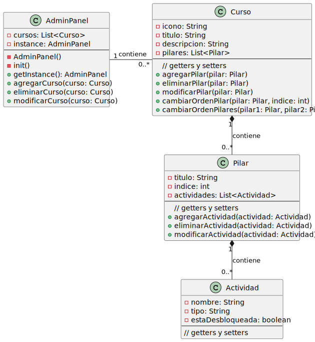

# Flexibilidad

## Definición

Siguiendo la definición de la ISO/IEC-25010 definimos el atributo de flexibilidad como:

>Capacidad del producto para adaptarse a cambios en sus requisitos, contextos de uso o entorno del sistema. Esta característica se subdivide a su vez en las siguientes subcaracterísticas:
>
>- **Adaptabilidad**. Capacidad del producto que le permite ser adaptado de forma efectiva y eficiente a diferentes entornos determinados de hardware, software, operacionales o de uso.
>- **Escalabilidad**. Capacidad del producto para gestionar cargas de trabajo crecientes o decrecientes y para adaptar su capacidad a la variabilidad.
>- **Instalabilidad**. Facilidad con la que el producto se puede instalar y/o desinstalar de forma exitosa en un determinado entorno.
>- **Reemplazabilidad**. Capacidad del producto para ser utilizado en lugar de otro producto software determinado con el mismo propósito y en el mismo entorno.

## Contextualización

En Ad-Astra, la flexibilidad es importante, ya que hay que preparar al sistema para un posible aumento en la demanda de usuarios y una creciente cantidad de cursos a futuro sin tener que modificar gran parte del sistema.

Además, es deseable que el sistema pueda ser exportado a distintos sistemas operativos con una sola arquitectura. Por último, es deseable que las piezas del sistema sean lo más modular posible para, si se requiere en un futuro, migrar a microservicios de forma fácil, sin tener que rediseñar gran parte del diseño.

De acuerdo a los requerimientos no funcionales RNF3:

| Código | Categoría |Descripción |
|--------|-----------|-------------|
| **RNF3.1** | Escalabilidad | Se podrán agregar nuevos cursos, pilares y actividades al sistema fácilmente. |
| **RNF3.2** | Escalabilidad | Se podrá realizar un CRUD de cualquier curso, pilar o actividad sin afectar de alguna forma a los ya existentes y/o la estructura del sistema. |

<!-- Posiblemente: Mapeando los requerimientos no funcionales a funcionalidades del sistema, podemos ver que la escalabilidad se puede lograr con un diseño modular y una arquitectura de microservicios. La instalabilidad se puede lograr con una arquitectura de contenedores y una base de datos que permita fácilmente la migración de un sistema a otro. -->

## Presencia de la flexibilidad en el sistema

Mapeando los requerimientos de flexibilidad con los requerimientos funcionales:

| RNF / RF | RF1 | RF2 | RF3 | RF4 | RF5 | RF6 | RF7 | RF8 | RF9 | RF10 | RF11 |
|----------|-----|-----|-----|-----|-----|-----|-----|-----|-----|------|------|
| **RNF3.1** | **X** | | **X** | **X** | **X** | | | | | | |
| **RNF3.2** | **X** | | | **X** | | | | **X** | | | |

### Justificación del mapeo

1. **RNF3.1** (Agregar nuevos cursos, pilares y actividades fácilmente):
    - **RF1**: Guardar cursos en la nube requiere flexibilidad para agregar nuevos cursos.
    - **RF3**: Categorizar contenido de nuevas soft skills implica agregar actividades y cursos relacionados.
    - **RF4**: Publicar la lista de soft skills y actividades requiere fácil actualización y adición.
    - **RF5**: Actividades interactivas deben ser fácilmente agregables para mantener el sistema actualizado.

1. **RNF3.2** (CRUD en un curso, pilar o actividad sin afectar otros):
   - **RF1**: Guardar cursos en la nube debe permitir modificaciones sin afectar la estructura global.
   - **RF4**: Publicar listas de soft skills y actividades debe permitir actualizaciones sin afectar el sistema.
   - **RF8**: Acceso a contenido completado debe ser independiente de las modificaciones en otros cursos.

Partimos de un diagrama inicial del sistema para trabajar con los requerimientos no funcionales de flexibilidad:

A continuación, se presentan los diagramas de actividades y de clases que se utilizaron para mapear los requerimientos no funcionales con los funcionales:

**RNF3.1:**

**RNF3.2:**

## Bibliografía

ISO 25010. (s. f.). <https://iso25000.com/index.php/en/iso-25000-standards/iso-25010>

Gutierrez, O. O., Salgado, R. S., Díaz, O. G. F., & Pérez, J. R. (2019). Métricas para la Medición del Factor de Flexibilidad y el Factor de Herencia de Implementación de Sistemas de Software. Dialnet. <https://dialnet.unirioja.es/servlet/articulo?codigo=7425388>
