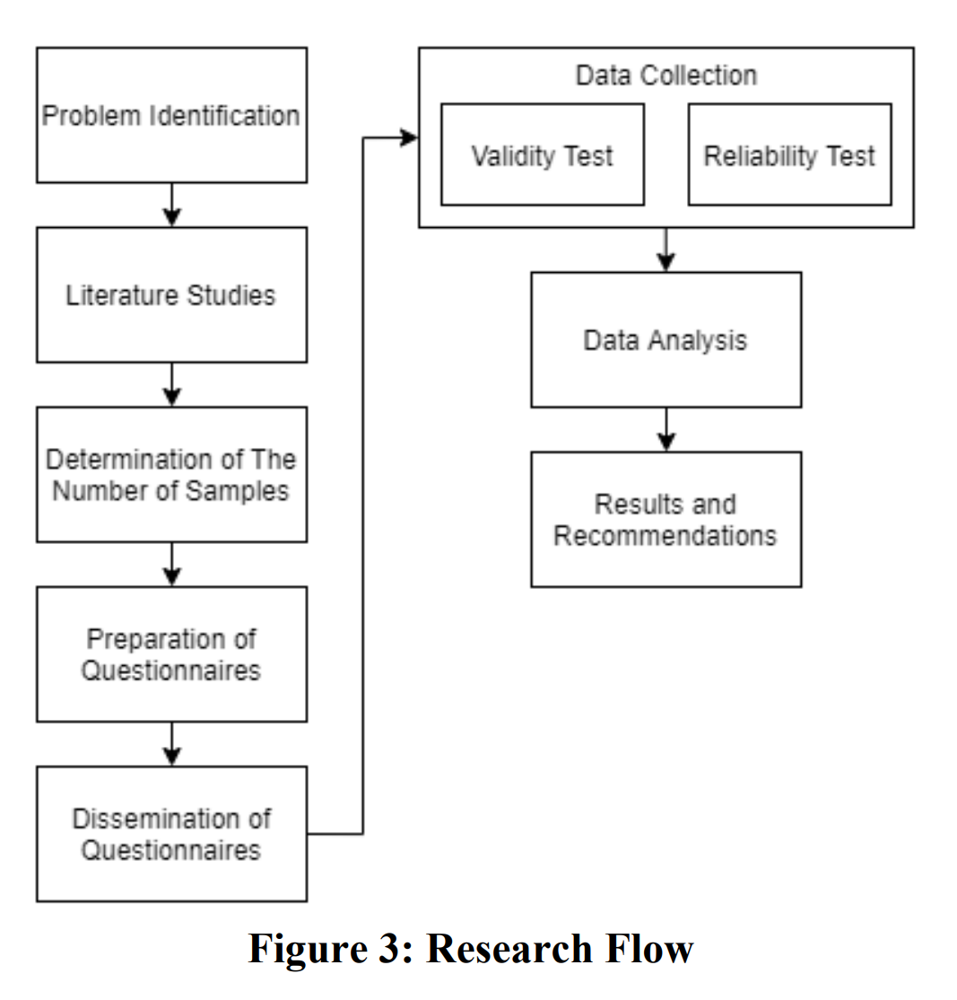
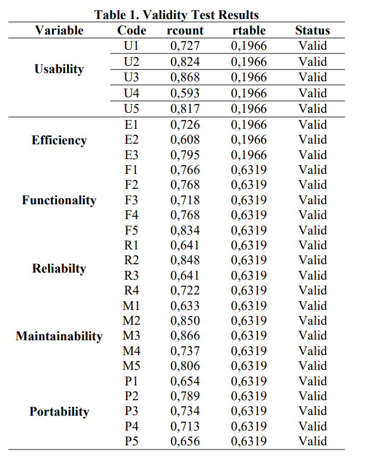
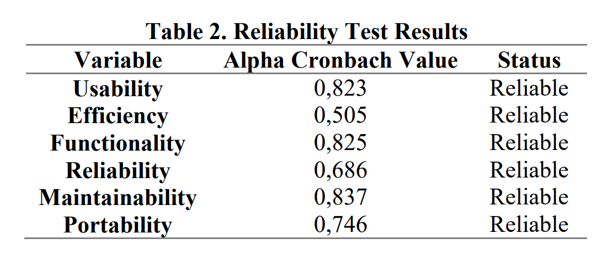

# Confiabilidad

La ISO, bajo la norma ISO-9126 $^1$, ha establecido un estándar internacional <ins>para la evaluación de la calidad de productos de software</ins> el cual fue publicado en 1992 con el nombre de _“Information technology Software product evaluation: Quality characteristics and guidelines for their use”_, en el cual se establecen las características de calidad para productos de software.
## Definición

De acuerdo con este modelo

Capacidad del software de mantener su nivel de ejecución bajo condiciones normales en un periodo de
tiempo establecido.

## Contextualización

De acuerdo a los requerimientos no funcionales RNF2 y RNF3:

| Código | Categoría | Descripción |
|--------|-----------|-------------|
| RNF.2 | Requerimiento de confiabilidad | |
| RNF.2.1 | Persistencia del Progreso | El progreso del usuario será persistente entre dispositivos. |
| RNF.2.2 | Disponibilidad de Contenido | El contenido de los cursos y actividades siempre estarán disponibles para su consulta. |
| RNF.2.3 | Disponibilidad del Sistema | El sistema estará mayormente disponible durante las horas de mayor actividad o eventos de alto tráfico. Se espera que el tiempo de inactividad del sistema se mantenga dentro de límites aceptables, lo que resultará en una espera razonable por parte de los usuarios. |
| RNF.2.4 | Reconocimiento del Progreso | El sistema debe ser capaz de reconocer el progreso del usuario en la mayoría de las ocasiones. Se espera que las fallas en el reconocimiento del progreso sean extremadamente raras y se deben evitar en la medida de lo posible. |

# Caso de Uso

## Software Quality testing on the e-SIM application based on ISO 9126

Se realizó sobre una aplicación de e-SIM basada en móviles utilizada por la Policía de Sidoarjo City Resort para facilitar la emisión y extensión de licencias de conducir para los ciudadanos indonesios. La aplicación no había sido probada previamente en cuanto a su calidad de software, por lo que el objetivo del estudio fue medir dicha calidad basándose en la norma ISO 9126 y proporcionar recomendaciones basadas en los resultados de las pruebas de calidad del software realizadas.

### Método

La investigación fue conducido usando métodos cuantitativos. Recolección de datos, procesamiento de datos, análisis de datos y conclusiones.

> Este diagrama muestra la serie de actividades en orden secuencial donde se aborda desde la identificación del problema hasta el análisis de datos y conclusión

### Resultados y discusiones

#### Encuestados

En total fueron 110 personas las que se involucraron en el estudio. 100 fueron usuarios *normales* de la aplicación, mientras que los otros 10 fueron funcionarios. Cuestionarios enviados a estas 10 personas fueron usados para medir las variables: funcionaliadad, confiabilidad, mantenibilidad y portabilidad, debido a que la aplicación de funcionarios es una parte que entiende el sistema de e-sim application.

#### Prueba de validez

Una prueba de validez se utiliza para averiguar si un elemento de las preguntas planteadas a un encuestado vale la pena usar. La técnica que se utiliza para medir la validez es la técnica del momento del producto de Pearson.

> Como se puede notar todos los elemento fueron declarados como válidos

#### Prueba de confiabilidad

Con el fin de obtener resultados de medición consistentes con respecto a los instrumentos que se han 
desplegado, se llevan a cabo pruebas de fiabilidad.

> Esta prueba no hace referencia al atributo de calidad "Confiabilidad", sino a la prueba del instrumento con que se evalua en cuestión. 

Los resultados son los siguientes

> Como se puede apreciar, todas las variables fueron declaradas "confiables"

---

- $^1$ Calidad en la Industria del Software. La Norma ISO-9126 https://www.nacionmulticultural.unam.mx/empresasindigenas/docs/2094.pdf

